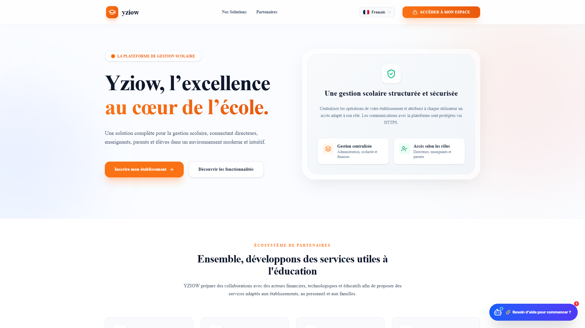
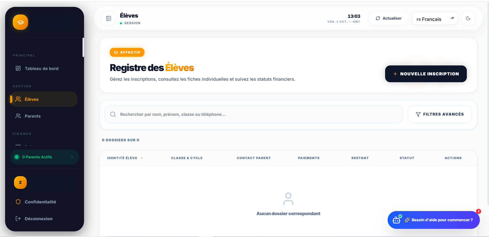
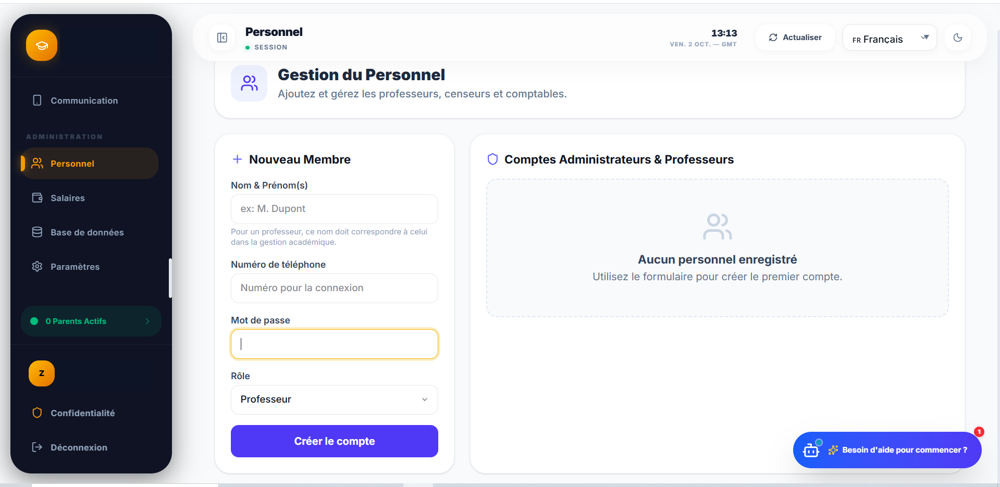
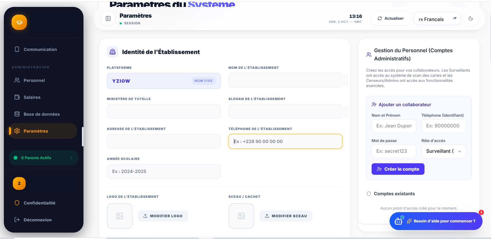
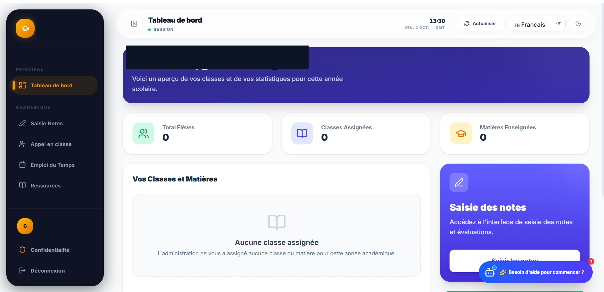
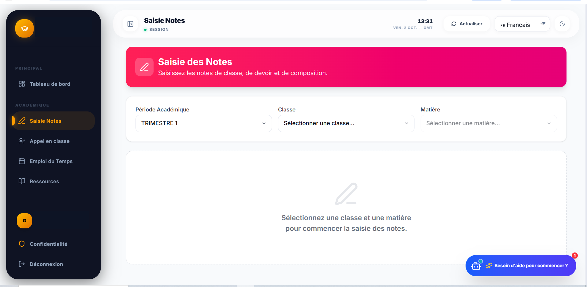
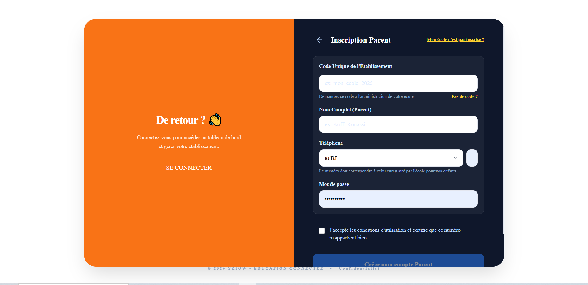
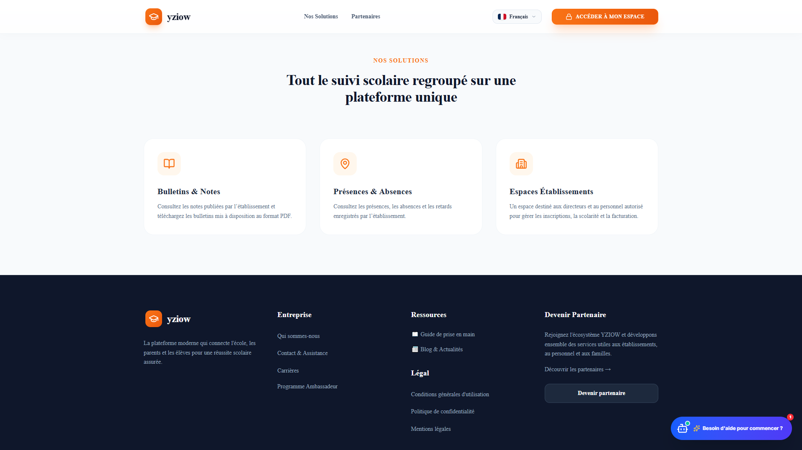

  
  yziow

  # Manuel Utilisateur
  ## YZIOW Production — Version 2
  *Votre plateforme de gestion scolaire centralisée*

---

## Table des Matières

1. [Présentation et Public Concerné](#1-présentation-et-public-concerné)
2. [Conseils de Sécurité](#2-conseils-de-sécurité)
3. [Création de Compte et Connexion](#3-création-de-compte-et-connexion)
4. [Guide Direction / Administration](#4-guide-direction--administration)
5. [Guide Enseignant](#5-guide-enseignant)
6. [Guide Parent / Élève](#6-guide-parent--élève)
7. [Communication et Aides](#7-communication-et-aides)
8. [Dons et Mécénat](#8-dons-et-mécénat)
9. [Dépannage et Assistance](#9-dépannage-et-assistance)
10. [Conclusion](#10-conclusion)

## 1. Présentation et Public Concerné

**YZIOW** est une plateforme moderne de gestion scolaire centralisant les opérations des établissements éducatifs. 
Ce manuel est destiné aux quatre principaux acteurs de la vie scolaire :

- **Direction et Administration** : Pilotage de l'établissement, gestion des finances, des élèves et du personnel.
- **Enseignants** : Saisie des notes, appel (présences), suivi pédagogique.
- **Parents** : Suivi des notes, devoirs, présences et paiements pour leurs enfants.
- **Élèves** : Consultation de leur emploi du temps, notes et devoirs.

  

## 2. Conseils de Sécurité

La sécurité de vos données scolaires et personnelles est notre priorité absolue.

1. **Mot de passe robuste** : Utilisez un mot de passe complexe, mêlant majuscules, minuscules, chiffres et caractères spéciaux.
2. **Déconnexion** : Si vous utilisez un ordinateur ou un appareil partagé (salle des professeurs, cybercafé), déconnectez-vous toujours de votre session YZIOW avant de quitter.
3. **Maintien des accès** : Ne partagez jamais vos identifiants ou votre téléphone de connexion. L'administration ne vous demandera jamais votre mot de passe par message.
4. **Vérification** : Assurez-vous toujours que vous naviguez sur l'adresse officielle de l'établissement avant de saisir vos identifiants.

---

## 3. Création de Compte et Connexion

### Inscription d'un établissement (Pour les Directeurs)
1. **Point de départ** : Rendez-vous sur la page publique d'inscription.
2. **Étapes** :
   - Renseignez les informations de l'établissement (Nom, Pays, Ville, Téléphone, etc.).
   - Renseignez les informations du directeur (Nom complet, Téléphone, Mot de passe).
   - Acceptez les conditions générales puis cliquez sur valider.
3. **Résultat** : Votre compte administrateur est créé et vous pouvez accéder à la plateforme.

### Connexion
1. **Point de départ** : Page de connexion publique.
2. **Étapes** : Saisissez votre numéro de téléphone et votre mot de passe.
3. **Résultat** : Vous êtes redirigé vers le tableau de bord correspondant à votre profil (Direction, Enseignant ou Parent).

## 4. Guide Direction / Administration

L'espace Direction est le cœur de la gestion de l'établissement.

### Tableau de bord
Vue d'ensemble sur les statistiques clés de votre établissement (effectifs, finances, etc.).

### Gestion des Élèves
1. Allez dans le **Registre des Élèves**.
2. Cliquez sur **Nouvelle Inscription**.
3. Remplissez l'Identité (Nom, prénoms, sexe, téléphone du parent).
4. Remplissez la section Scolarité (Classe, Frais de scolarité, versement initial).
5. Validez pour mettre à jour la liste. Une barre de recherche vous permet de retrouver rapidement un élève par nom, prénom ou téléphone.

  
  
<em>Ouvrez ce menu pour accéder à la liste et inscrire un nouvel élève</em>

### Gestion des Classes
Accédez à la rubrique **Gestion Académique** pour configurer vos classes, attribuer les matières et planifier l'année.

### Gestion du Personnel et des Enseignants
Rendez-vous dans la **Gestion du personnel** pour inviter et attribuer des rôles à vos collaborateurs et enseignants.

  
  
<em>Remplissez ce formulaire pour créer le compte d'un collaborateur</em>

### Paramètres
La page **Paramètres** vous permet d'ajuster la configuration globale de l'école (slogan, logo, etc.).

  
  
<em>Cliquez ici pour modifier les informations de l'établissement</em>

## 5. Guide Enseignant

L'espace Enseignant permet de gérer le quotidien de la classe.

  
  
<em>Consultez vos classes assignées et vos statistiques</em>

- **Accès aux classes** : Retrouvez la liste des classes qui vous sont attribuées.
- **Saisie des présences** : Utilisez l'outil d'appel numérique pour pointer les absences ou les retards.
- **Saisie des notes** : Entrez les évaluations de vos élèves. Les résultats seront automatiquement compilés pour les bulletins et notifiés aux parents.

  
  
<em>Remplissez ce formulaire pour attribuer les notes</em>

---

## 6. Inscription Parent

Les parents disposent d'un portail dédié. Pour y accéder la première fois :

1. Cliquez sur **« Je suis parent, créer mon compte »** depuis la page de connexion.
2. Renseignez le code unique de l'établissement (fourni par l'école).
3. Renseignez votre nom, votre numéro de téléphone (celui déjà communiqué à l'école) et choisissez un mot de passe.
4. Acceptez les conditions d'utilisation.
5. Cliquez sur **Créer mon compte Parent**.

  
  
<em>Remplissez ce formulaire pour créer votre compte Parent</em>

*En cas de problème (code non reconnu ou téléphone invalide), veuillez contacter directement l'administration de votre établissement.*

---

## 7. Communication et Aides

YZIOW fluidifie les échanges entre l'école et les familles.

- **Annonces** : La direction peut diffuser des communiqués officiels ou des annonces globales à tous les utilisateurs.
- **Chat / Messages** : Un système de messagerie interne permet de communiquer directement (ex: entre enseignants et direction, ou parents et administration), assurant une traçabilité et une réactivité maximale.

## 8. Dons et Mécénat

YZIOW facilite la levée de fonds pour les projets de votre établissement.

### Propositions de partenariats
Depuis la page des partenaires, un formulaire permet de soumettre des propositions commerciales (limité à 5000 caractères).

### Campagnes de Dons
- **Administration (Direction)** : Vous pouvez créer une nouvelle campagne de dons (titre, objectif financier, description) et suivre l'évolution des collectes (statistiques, donateurs uniques).
- **Retrait des fonds** : Depuis l'espace de gestion, la direction peut initier le transfert des fonds récoltés vers un compte bancaire ou Mobile Money.
- **Soumission (Public)** : Les personnes intéressées peuvent utiliser la page partenaire pour signaler leur intention de don parmi 6 catégories proposées, créant un dossier mis "en attente" de traitement.

---

## 9. Dépannage et Assistance

**Problème de connexion ?**
- Vérifiez que votre numéro de téléphone a bien été saisi avec son indicatif (si exigé).
- Assurez-vous de respecter les majuscules/minuscules de votre mot de passe.

**Besoin d'assistance ?**
- Si vous êtes parent ou élève, contactez en priorité l'administration de votre établissement via la messagerie interne de l'école ou par téléphone.
- Si vous êtes la direction, consultez les paramètres de l'application ou l'aide fournie par l'équipe support de la plateforme YZIOW.

## 10. Conclusion

L'utilisation d'YZIOW vous permettra de gagner un temps précieux tout en garantissant un suivi rigoureux de toutes vos activités éducatives.

  *YZIOW - L'excellence au service de l'éducation.*

  

